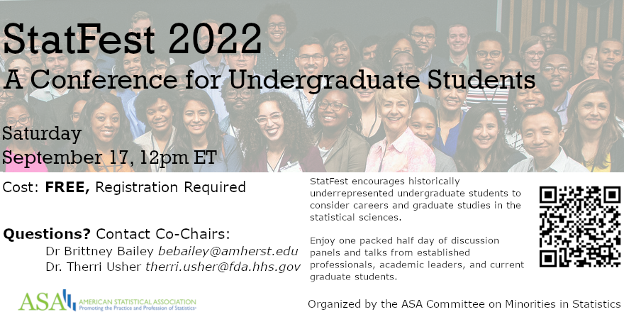

```{r setup, include=FALSE}
knitr::opts_chunk$set(echo = TRUE)
```

### Announcements

- Notecard due at end of class. Answer one (or more):
    + What was most confusing/unclear?
    + What questions are you wondering about?
    + How can I be praying for you? 
- Prepare activities due by classtime Tuesday (76mins, across 4 mini-lectures)
- Lab 01 due Tuesday, 11:59pm
- Attend StatFest (and earn Statistics Experience points!)

```{r, echo = FALSE}

```


### Questions?


### Lab 01

- The remainder of class will be spent on Lab 01. 
- You can access the INSTRUCTIONS on the course website
- You can access the template for your report in RStudio Cloud. - Work in Lab 01 - 02 groups (see Canvas), submit individually (this time only)
- To turn it in, you should upload your .html file to Canvas.