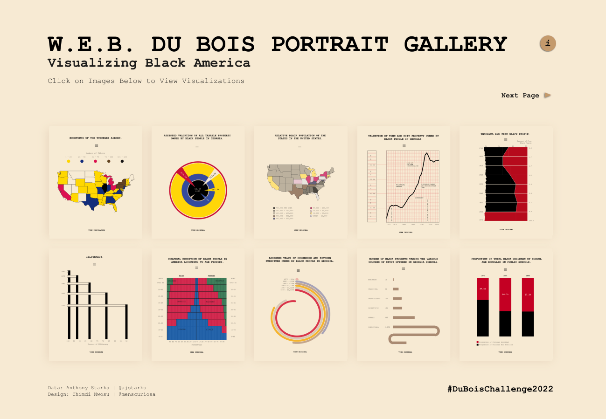
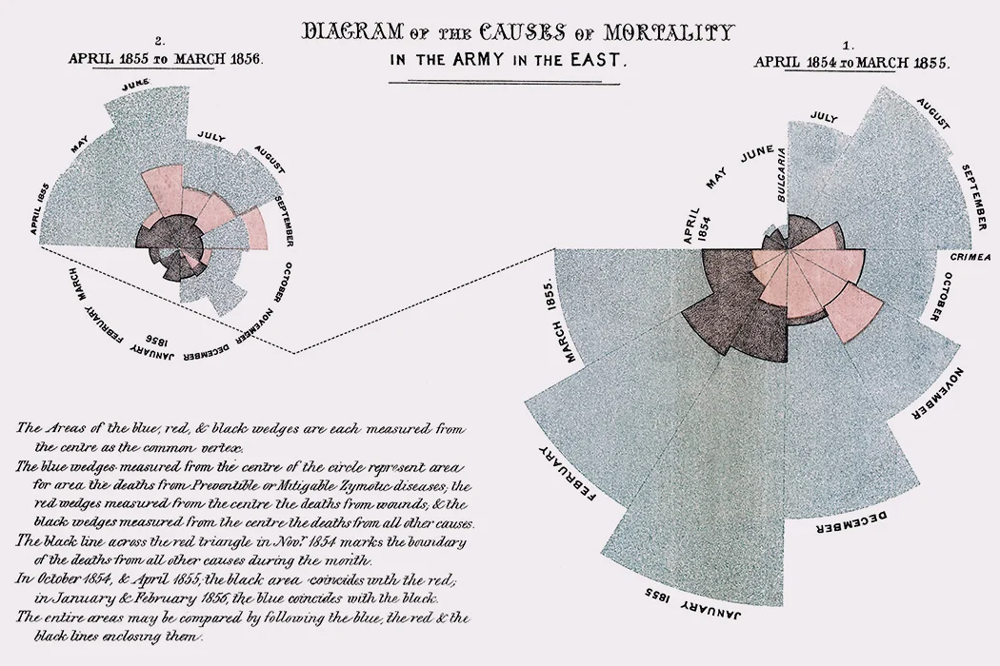

```{r setup, include=FALSE}
knitr::opts_chunk$set(echo = TRUE)
```

```{r, message = FALSE, warning = FALSE, echo = FALSE}
library(tidyverse)
library(ggthemes)
#library(bbplot)
library(cowplot)
```


### Statistician(s) of the Week 

[W.E.B. DuBois](https://hardin47.github.io/CURV/scholars/dubois.html)

Check out his [book](https://www.amazon.com/W-Boiss-Data-Portraits-Visualizing/dp/1616897066)! I have a copy in my office.



[Florence Nightingale](https://hardin47.github.io/CURV/scholars/nightingale.html)



### Announcements


### A few notes / tips

- You don't need to memorize code
- Setting changes (under Settings icon):
    - Select "Preview in Viewer Pane"
    - Select "Chunk Output in Console"
- Add `color = "white"` to your `geom_histogram()` layers

```{r, message = FALSE, warning = FALSE, echo = FALSE}
p1 <- ggplot(midwest, aes(x = percbelowpoverty)) +
  geom_histogram()

p2 <- ggplot(midwest, aes(x = percbelowpoverty)) +
  geom_histogram(color = "white") +
  labs(title = "geom_histogram(color = \"white\")")

plot_grid(p1, p2, nrow = 1)
```

- Check out different theme options in `ggplot`. Default is `theme_gray()`. I typically use `theme_minimal()` to de-clutter some of the background. 

```{r, echo = FALSE}
p1 <- ggplot(midwest, aes(y = percbelowpoverty, x = area,
                    color = state)) +
  geom_point() +
  labs(title = "theme_gray()") +
  scale_color_viridis_d()

p2 <- ggplot(midwest, aes(y = percbelowpoverty, x = area,
                    color = state)) +
  geom_point() +
  theme_minimal() +
  labs(title = "theme_minimal()") +
  scale_color_viridis_d()

plot_grid(p1, p2, nrow = 1)
```

+ The [`ggthemes` package](https://github.com/jrnold/ggthemes) has many additional themes to choose from

```{r, echo = FALSE}
p1 <- ggplot(midwest, aes(y = percbelowpoverty, x = area,
                    color = state)) +
  geom_point() +
  theme_fivethirtyeight() +
  labs(title = "theme_fivethirtyeight()") +
  scale_color_viridis_d()

p2 <- ggplot(midwest, aes(y = percbelowpoverty, x = area,
                    color = state)) +
  geom_point() +
  theme_wsj() +
  labs(title = "theme_wsj()") +
  scale_color_viridis_d()

p3 <- ggplot(midwest, aes(y = percbelowpoverty, x = area,
                    color = state)) +
  geom_point() +
  theme_economist() +
  labs(title = "theme_economist()") +
  scale_color_viridis_d()

p4 <- ggplot(midwest, aes(y = percbelowpoverty, x = area,
                    color = state)) +
  geom_point() +
  theme_solarized_2(light = FALSE) +
  labs(title = "theme_solarized_2(light = FALSE)") +
  scale_color_viridis_d()

plot_grid(p1, p2, p3, p4, nrow = 2)
```

+ This blogpost ["Themes to spice up visualizations with ggplot2"](https://towardsdatascience.com/themes-to-spice-up-visualizations-with-ggplot2-3e275038dafa) suggests several more packages with many additional themes to play with

+ Make sure to use colorblind friendly palletes! `scale_color_viridis_d` (and its variations) is my default, `scale_color_colorblind()` is another common option, from the `ggthemes` package

```{r, echo = FALSE}
p1 <- ggplot(midwest, aes(y = percbelowpoverty, x = area,
                    color = state)) +
  geom_point() +
  theme_minimal() +
  labs(title = "scale_color_viridis_d()") +
  scale_color_viridis_d()

p2 <- ggplot(midwest, aes(y = percbelowpoverty, x = area,
                    color = state)) +
  geom_point() +
  theme_minimal() +
  labs(title = "scale_color_colorblind()") +
  scale_color_colorblind()

plot_grid(p1, p2, nrow = 1)
```

+ Save the fiddling with beautification until the end - this can be an endless time suck if you're not careful :)

+ Keep in mind that you're not just practicing your technical coding skills, but you're also developing your investigative skills as a data scientist - **be curious about the data** and **dig further** into it when your visualizations reveal certain patterns or unusual observations.


### Questions?

*What are the possibilities for theme/layout for R?*

+ [html themes](https://www.datadreaming.org/post/r-markdown-theme-gallery/) we saw in Lab 01
+ Note, you can use RMarkdown to create
    + pdfs, word documents, presentation slides
    + books using the `bookdown` package (see [here](https://openintro-ims.netlify.app) and [here](https://nustat.github.io/intro-stat-ds/))
    + websites using the `blogdown` package (see [here](https://www.silviacanelon.com) and [here](https://katie-fitzgerald.netlify.app)), and 
    + interactive web apps using the `shiny` package (see [here](https://gallery.shinyapps.io/freedom-press-index/?_ga=2.81315735.1827555729.1662265788-1653842836.1662265788#home) and [here](https://kgfitz.shinyapps.io/confidence_intervals/?_ga=2.165073215.1872464027.1644259610-1518862278.1644259610))!
    
*How do I find out what kinds of datasets I could view in R using the tidyverse?*

+ Running the command `data()` in your console will let you view a list of all datasets available in your currently loaded packages
+ Otherwise, Google is your best friend :)
+ We'll learn how to load data via external files (or even urls) later on!

*I don't understand why `aes()` was the term used to assign columns (variables) to axes. These assignments define the graph, not just their aesthetic*

+ in data viz/grammar of graphics language, "aesthetics" means a mapping between a variable and a visual cue. Some common visual cues:

    + position (`x`, `y` axis)
    + `color` ("outside" color)
    + `fill` ("inside" color)
    + `shape` (e.g. circle, square, triangle)
    + `linetype` (e.g. solid, dotted, dashed)
    + `size`
    + transparency (`alpha`)
    
*Having seen the notes on the ggplot function, I think it generally makes sense, I am just wondering: how do I know when to keep my plot basic (with the ggplot and the geom_x command) and when to add on extra commands?*

+ We'll practice a lot more with visualizations this week! At minimum: your labels should be informative and readable. Feel free to get as fancy as you want, but readability is the primary goal! 


### Application Exercise

- The remainder of class will be spent on AE-02. 
- You can access it from GitHub. 
- It is due at the end of class today. 
- To turn it in, you should upload your .html file to Canvas.