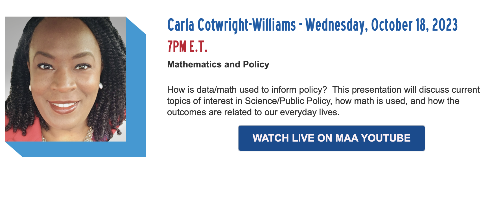
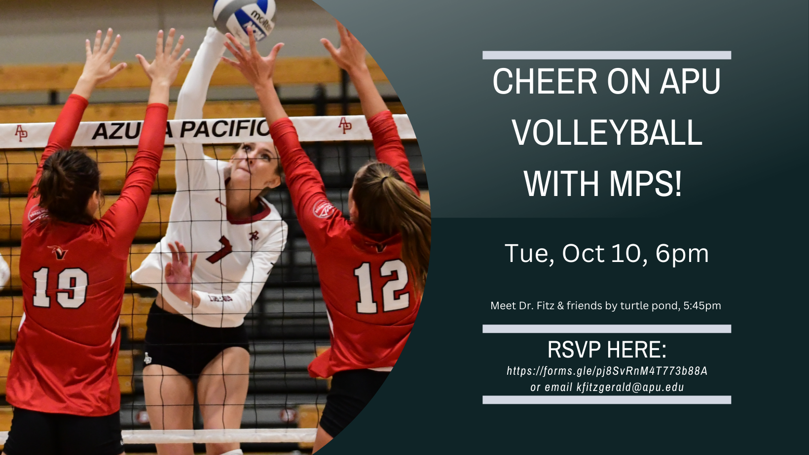
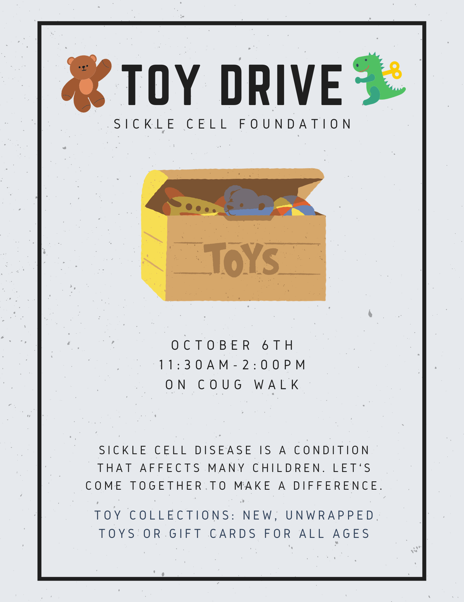

```{r setup, include=FALSE}
knitr::opts_chunk$set(echo = TRUE)
```

### Statistician(s) of the Week

[Sherri Rose](http://drsherrirose.org/biocv)

[Liz Stuart](https://publichealth.jhu.edu/faculty/1792/elizabeth-a-stuart)

### Announcements

[International Day of Women in Statistics & Data Science](https://www.idwsds.org/program/)

-   October 10, 24-hour virtual conference

-   2 stats experience points

[Undergraduate Statistics Class Project Competition](https://www.causeweb.org/usproc/report-template-USCLAP)



[Electronic Undergraduate Statistics Research Conference](https://www.causeweb.org/usproc/eusr/2023/program)

-   Friday, November 3

-   Director of Census Bureau, Robert Santos, is keynote speaker

-   Panel discussions on grad school & career





### Questions / Feedback

### Application Exercise

-   The remainder of class will be spent on AE-05.
-   You can access it from GitHub.
-   It is due at the end of class today.
-   To turn it in, you should upload your .html file to Canvas.
