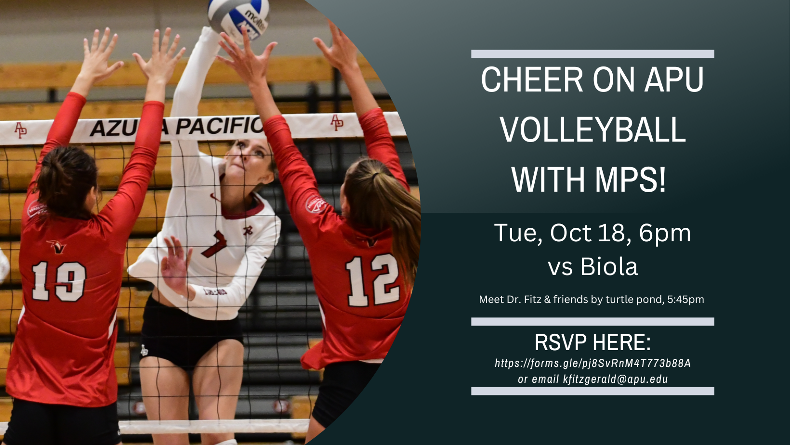

```{r setup, include=FALSE}
knitr::opts_chunk$set(echo = TRUE)
```

### Thursday Announcements

-   Annotated Exam corrections due Saturday - will work on these some today

    -   <https://kgfitzgerald.github.io/APU_MATH_250/ae/week-07-exam-corrections.html>

-   HW 03 assigned today, due next Thursday

-   Project timeline:

    -   Will meet with each group today to finalize dataset / research question

    -   Data cleaning / preliminary EDA due Oct 27

        -   Clean variable names

        -   Convert to appropriate data types (factors, dates, etc)

        -   Re-order factor levels as needed

        -   Investigate and handle missing data

        -   Visualize each variable (or \~10 prominent variables), note any issues or notable features

        -   Describe your analysis plan for answering your research question

            -   What types of visualizations or summary tables will you create?

            -   What types of models or inference procedures will you run, if any?

-   Sign up for advising appointments!

    -   Junior and Senior MPS majors (or minors)

    -   To make an appointment, go to this [calendar link](https://calendar.google.com/calendar/u/0/selfsched?sstoken=UUNFd3FSS2lGUjZufGRlZmF1bHR8MThkNjJlMGFlOTdmZjQ2YzM1MWFhZjcwMTI2Mzg0MmQ) and select a time for the advisor of your choice. Appointments are available October 17 to October 28.

-   RSVP for volleyball game: <https://forms.gle/pj8SvRnM4T773b88A>



### Tuesday Announcements


RSVP: <https://forms.gle/pj8SvRnM4T773b88A>

-   Project Proposal due tomorrow (Wednesday), 11:59pm

    -   Part of Thursday will be work session, I will meet briefly with each group to finalize research question & dataset

-   Exams graded

    -   1st quartile: 87.75

    -   Median: 92

    -   3rd quartile: 97.5

-   Annotated test corrections due Saturday, 11:59pm

    -   1/3 of points back

    -   Make a copy of your original Exam.qmd file, name it appropriately

    -   Include all original code / interpretation

    -   For each problem you didn't get full credit for, add:

        -   Subheader called "ANNOTATED CORRECTIONS"

        -   Articulation of your mistake / misunderstanding

        -   Correct solution & explanation of how new code works (if new code added)

    -   Re-submit is as a New Attempt to Exam 1 on Canvas

-   Stats Experience Opportunities

    -   Happy [International Day of Women in Statistics & Data Science!](http://www.idwsds.org)

        -   24-hour virtual conference, Oct 11, recordings made available after the fact

        -   Speakers from New Zealand, Korea, India, Cyprus, US, and others

    -   [Orange County Biostatistics Symposium](https://www.eventbee.com/v/2022ocbiostatisticssymposium#/tickets)

        -   THIS weekend, Oct 14 - 15

        -   Student price: \$10 for one day, \$15 for both days

        -   Biostatistics, clinical trials, drug development

    -   eUSR - [Electronic Undergraduate Statistics Research Conference](https://www.causeweb.org/usproc/eusr/2022)

        -   FREE, virtual, Friday, Nov 4

        -   Keynote speaker from NORC - National Opinion Research Center

        -   Panelists from New York Yankees, Google, Microsoft, U.S. Census Bureau, Wisconsin Department of Health Services

    -   [Nov 7 Colloquium at UCLA](https://community.ucla.edu/event/35672c9e-405b-4c3a-9f78-57e32517009d)

        -   Quantitative Approaches to Criminal and Social Justice: Mitigating Inequity for Racially Minoritized Individuals in Policing, Sentencing, and Incarceration

        -   Monday, Nov 7, 12-1pm, in-person at UCLA

### Questions?

### Faith Integration Discussion

-   There is no AE this week
-   The remainder of class will be spent on a Faith Integration Discussion

### Statistics for Social Good Resources

-   AMSTAT News special issue: [Data literacy as a tool for community health and social justice](https://magazine.amstat.org/wp-content/uploads/2022/08/AmstatSeptember.pdf)

-   [DataKind](https://www.datakind.org)

-   [Data4SDGs](https://www.data4sdgs.org): Data for Sustainable Development Goals

-   [HRDAG](https://hrdag.org): Human Rights Data Analysis Group

-   [Statistics Without Borders](https://www.statisticswithoutborders.org)
