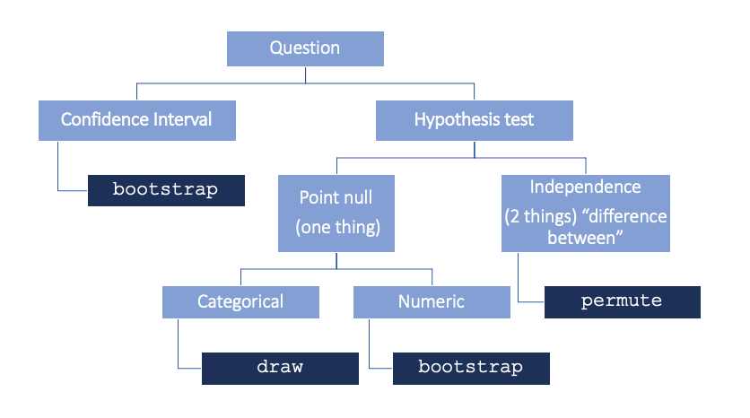

```{r setup, include=FALSE}
knitr::opts_chunk$set(echo = TRUE)
```

### Announcements

-   AE-10 today in class, due Thursday, 4:20pm
-   HW-05 due Thursday, 11:59pm
-   Project Rough Draft due Thursday, 11:59pm
-   Thursday in-class: Lab 09 (last one!)
-   Presentations / Christmas party at my place in Pasadena? Fill out [this form](https://forms.gle/m1FNm6g5VypV9vEs8).

### Questions?

-   What are all the packages we need to do what is demonstrated in the lectures?

    -   `infer`

    -   `tidyverse`

-   When do we use `null = "point"` vs `null = "independence"` etc?

    

-   I remember that sometimes we changed the cutoff from 5% - I'm not sure when that happens or if I am just recalling incorrectly?

    -   Cutoff = Type I (false positive) error rate. Cutoff of $\alpha = 0.05$ means you will get false positive 5% of time when $H_0$ is true

    -   If false positive is the riskier error in your context, can reduce cutoff (e.g. $\alpha = 0.01, 0.005$), but be cognizant of the trade-off that it increases your Type II (false negative) error rate

### Application Exercise

-   The remainder of class will be spent on AE-10.
-   You can access it from your RStudio Cloud account.
-   It is due by class-time on Thursday.
-   To turn it in, you should upload your .html file to Canvas.
