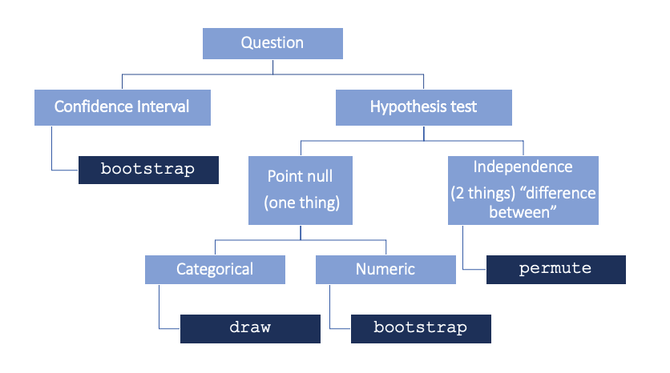

```{r include=FALSE}
library(tidyverse)
library(tufte)
library(knitr)
options(
  htmltools.dir.version = FALSE, # for blogdown
  show.signif.stars = FALSE,     # for regression output
  digits = 2
  )
knitr::opts_chunk$set(eval = FALSE)
```

## Getting started

For this lab, you will collaborate in groups, but you will turn in an individual .html document. In RStudio Cloud, 

+ Navigate to the `MATH_250_individual` workspace 
+ Launch the `Week 12` project
+ Open `lab-09.qmd`

All code should follow the tidyverse style guidelines. Make sure to clean up tables and figures and suppress extraneous output.

# What makes a good burrito?

The goal of today's lab is to practice two-sample statistical inference using a simulation approach.

Use the lecture notes, readings, and application exercises to help you complete the lab.
You can also use the chart on simulation-based inference below to help you determine the appropriate sampling scheme when conducting simulation-based inference.



# The Data

```{r, echo = FALSE, eval = FALSE}
library(tidyverse)
library(janitor)
burritos <- read.csv("/Volumes/GoogleDrive/My Drive/MATH250/APU_MATH_250_public/labs/data/Burrito - 10D.csv")

burritos <- burritos %>% 
  clean_names() %>% 
  select(tortilla, temp, meat, fillings, salsa,
         uniformity, synergy, guac, cheese, fries,
         sourcream = sour_cream, rice, beans, cost, volume) %>% 
  mutate(across(where(is.character), ~ if_else( . == "x", "present", "none"))) %>% 
  drop_na()

write_csv(burritos, "/Volumes/GoogleDrive/My Drive/MATH250/APU_MATH_250_public/labs/data/burritos.csv")
```

Today's dataset has been adapted from Scott Cole's *Burritos of San Diego* project, located [**here**](https://srcole.github.io/100burritos/).
The goal of the project was to identify the best and worst burritos in San Diego, characterize variance in burrito quality, and generate predictive models for what makes a burrito great.

As part of this project, 71 participants reviewed burritos from 79 different taco shops. 

Reviewers captured objective measures of the burrito (such as whether it contains certain ingredients) and reviewed it on a number of metrics (such as quality of the tortilla, the temperature, quality of meat, etc.).
For the purposes of this lab, you may consider each of these observations to be an independent, representative sample of all burritos.

The subjective ratings in the dataset are as follows.
Each variable is ranked on a 0 to 5 point scale, with 0 being the worst and 5 being the best.

-   `tortilla`: quality of the tortilla
-   `temp`: temperature of the burrito
-   `meat`: quality of the meat
-   `fillings`: quality of non-meat fillings
-   `salsa`: quality of the salsa
-   `uniformity`: whether each bite contains a uniform slew of ingredients (e.g., a bite entirely composed of tortilla and sour cream would probably be terrible)
-   `synergy`: how well it all comes together

In addition, the reviewers noted the presence of the following burrito components.
Each of the following variables is a binary variable taking on values `present` or `none`:

-   `guac`: guacamole
-   `cheese`: cheese
-   `fries`: fries
-   `sourcream`: sour cream
-   `rice`: rice
-   `beans`: beans

The `cost` and `volume` of the burrito was also recorded.

You can read in the data from the `data` folder in the `Week 12` project in your RStudio Cloud workspace. 

# Exercises

**At the start of each exercise that requires simulation, set a random seed** **equal to the exercise number in the R chunk.**

1.  Sour cream on burritos: yay or nay? Explain. Personal opinions only, no stats needed :)
2.  Suppose you are worried that the presence of sour cream adversely affects the perceived temperature of the burrito. Comprehensively evaluate the hypothesis that the mean temperature of burritos with sour cream is lower than burritos without sour cream using a simulation-based approach.
3.  Construct and interpret a 95% two-sided confidence interval for the difference you investigated in Exercise 2 using a simulation-based approach.
4.  Now suppose you are worried that sour cream adversely affects the perceived *uniformity* of the burrito. Comprehensively evaluate the hypothesis that the mean uniformity of burritos with sour cream is less than burritos without sour cream and construct and interpret a a 95% two-sided confidence interval.

## An aside about the **multiple comparisons** problem. 

When conducting a hypothesis test, you set a significance level, say $\alpha = 0.05$, which controls the Type I error of test, otherwise known as the false positive rate. That is, when you set your decision rule that you will reject $H_0$ when your p-value < $\alpha = 0.05$, this means you will falsely reject $H_0$ 5% of the time when it is in fact true. 

When conducting several hypothesis tests as part of the same analysis, the probability of obtaining a false positive on at least one of them can be much higher than 5%, even though the probability is only 5% on each individual test. To see this, we can think of a Type I error (a false positive) as being the result of a bernoulli trial (think: coin flip) with a probability of "success" of 0.05. If we conduct $n$ hypothesis tests, and define $X$ to be the number of false positives in $n$ tests, then $X$ is a binomial random variable with size $n$ and probability $p = 0.05$. 

The visualization below shows the distribution of how many false positives we might expect if we conduct 10 hypothesis tests, each with a significance level of $\alpha = 0.05$. 

```{r, eval = TRUE}
set.seed(437)
sims <- data.frame(X = rbinom(10000, size = 10, prob = 0.05))

ggplot(sims, aes(x = X)) +
   geom_bar(color = "white") +
   labs(x = "X = Number of false positives",
       title = "Frequency of false positives out of 10 hypothesis tests",
       subtitle = "alpha = 0.05")
```

We can see that the probability of obtaining at least one false positive is over 40%!

```{r, eval = TRUE}
sims %>% 
  summarize(prob = sum(X>=1)/n())
```

It's obviously undesirable to have a high probability of observing a false positive, so it's important when conducting multiple analyses to **adjust for multiple comparisons** in order to control your overall Type I error rate (across all analyses) instead of the Type I error rate within each test. There are many methods for doing this, but the simplest is called the *Bonferroni correction* that uses a significance level of $\alpha/n$ for each of the $n$ individual tests. This ensures the overall Type I error rate (across all $n$ tests) does not exceed $\alpha$. For example, if you are conducting 10 hypotheses and want to control your overall Type I error rate to $\alpha = 0.05$, then you should use a significance level of $\alpha^* = 0.05/10 = 0.005$ for each test. 

5.  Suppose you perform 10 independent hypothesis tests at the $\alpha^* = 0.005$ level. Using code similar to the above simulations, determine the probability that you make at least one Type I error. Your results should confirm that the Bonferroni correction controls the overall Type I error rate to be no greater than 0.05. 
6.  Let's say you just really hate sour cream and are trying to demonstrate to others that it's associated with lower rating scores for tortilla quality, salsa quality, uniformity, synergy, etc. Describe the potential ethical ramifications of performing all of these tests with $\alpha = 0.05$ and reporting only the significant results from the tests that support your narrative. Consider your answer from Exercise 6 in crafting this narrative.
7. Estimate the average cost of a burrito in San Diego (this data was from 2016). Construct a 99% confidence interval to answer this question. 
8. A chicken burrito at Chipotle in Azusa currently costs \$9.10. Is there sufficient evidence that the average cost of a burrito in San Diego in 2016 was less than $9.10? Comprehensively evaluate this question using a hypothesis test. Include a visualization and a p-value, and state your conclusion. Comment on how this conclusion relates to your confidence interval in the previous exercise. 
9.  Create a new variable for overall burrito quality by taking the average scores for all ratings (tortilla quality, temperature, meat quality, etc.) in the dataset. Is there evidence that burritos with guacamole have a different average overall perceived quality score compared to burritos without guacamole? Comprehensively evaluate this question using any method of your choice.

## BONUS

The San Diego burrito is known for including fries in it (as a convenient way for surfers to top off their energy in a quick, convenient, and tasty format). Create a new categorical variable for overall burrito quality (from Exercise 9) under the following scheme, and comprehensively evaluate whether there is a relationship between this variable and whether the burrito has fries:

-   Overall burrito quality $\le$ 3: `alright`
-   Overall burrito quality $>$ 3 and $\le 4$: `solid`
-   Overall burrito quality $>$ 4: `whoa!`

Hints:

+ the outcome of interest here has more than two categories, so we are not looking simply at a difference in two proportions. The appropriate summary statistic to evaluate these data is `stat = "Chisq"`, which calculates the statistic for a Chi-square test of independence. 
+ you can utilize the `observe()` function to compute the observed Chi-squared statistic from the original `burritos` data


## Submission

Before submitting, open up your .html in a full window and inspect the following:

+ Check your code for neatness - add spaces and line breaks where appropriate to improve readability

+ Check any visualizations for informative and clean labels and titles

+ Check any tables for clean formatting (e.g. with `kbl() %>% kable_minmal()`)

+ Check that you've interpreted output as appropriate

+ Make sure extraneous warnings and messages are suppressed (e.g. set warning = FALSE, message = FALSE)

+ Check that Exercises are clearly labeled and your text responses are visually distinguished

+ Check for overall neatness & organization of the report (e.g. headers, subheaders, use of bullets, font changes)

To submit, you need to export your .html document from RStudio Cloud and then upload it to the Lab 09 assignment on Canvas. Refer back to [Lab 01](https://kgfitzgerald.github.io/APU_MATH_250/labs/lab-01-hello-r.html) for detailed instructions on how to export and submit your assignment. 

# Grading (50pts)

| Component | Points |
|:----------|:-------|
| Ex 1      | 2      |
| Ex 2      | 5    |
| Ex 3      | 5   |
| Ex 4      | 5   |
| Ex 5      | 5      |
| Ex 6      | 5    |
| Ex 7      | 5   |
| Ex 8      | 5   |
| Ex 9      | 5   |
| Workflow & formatting   | 8      |
| BONUS | 2 |

**Grading notes**:

-   The "Workflow & formatting" grade is to assess the reproducible workflow. This includes having readable code (e.g. adequate use of spacing and line breaks), labeled code chunks, informative headers and sub-headers, and an overall organized and uncluttered report (e.g. suppress messages & warnings, no extraneous output).
