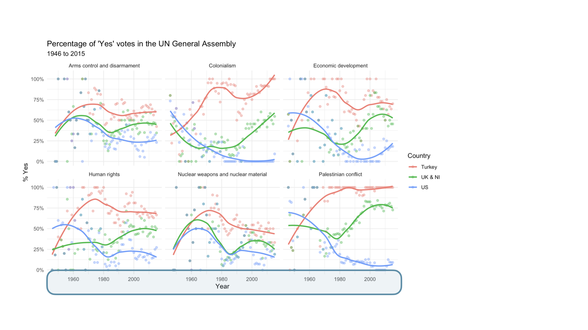
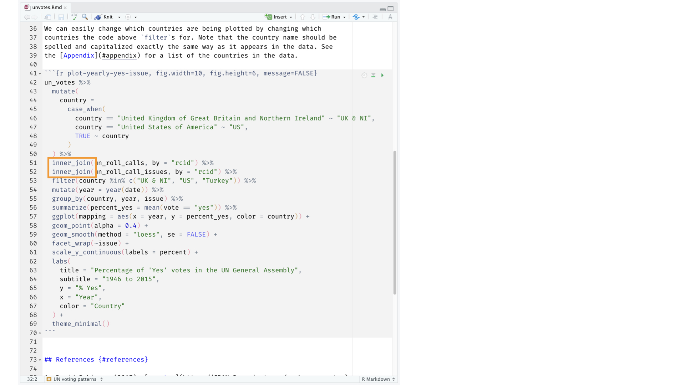
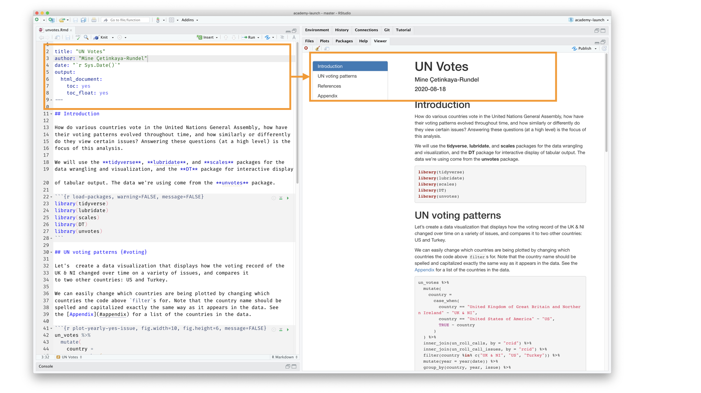

```{r child = "setup.Rmd"}
```

```{r echo=FALSE, message=FALSE, warning=FALSE}
library(tidyverse)
library(rvest)
```

---

class: middle, center

# MATH 250: Data Analysis (aka Intro to Data Science)

---

## What is data science?

- Data science is an exciting discipline that allows you to turn raw data into understanding, insight, and knowledge.

- Set of tools to help us be better **stewards of information**

- We're going to learn to do this in a `tidy` way -- more on that later!

<!-- - This is a course on introduction to data science, with an emphasis on statistical thinking. -->

---

## Course FAQ

**Q - What data science background does this course assume?**
A - None. Pre-req: one stats class

<br>
--

**Q - Is this a statistics course?**
A - While statistics $\neq$ data science, they are very closely related and have tremendous overlap. Hence, this course will help you utilize and further your statistical thinking. However this course is not your typical intro or mathematical statistics course.

<br>
--

**Q - What computing language / software will we use?**
A - R
--
<br>
<br>
**Q - Why not language/software X?**
A - We can discuss that over `r emo::ji("coffee")`

---

## Course learning objectives

- Learn to explore, visualize, and analyze data in a *reproducible* and *shareable* manner

--

- Gain experience in data wrangling, exploratory data analysis, predictive modeling, and data visualization

--

- Work on problems and case studies inspired by and based on *real-world questions* and data

--

- Learn to effectively communicate results through written assignments and final project presentation

---

## Some of what you will learn

.pull-left[
- Fundamentals of `R`

- Data visualization and wrangling with `ggplot2` and `dplyr` from the `tidyverse`

- Data science workflow and scientific practice

- Web based applications with `RShiny`

- Spatial data visualization

]

.pull-right[

- Data ethics

- Data types and functions

- Reproducible reports with `R Markdown`

- Regression and classification

- Statistical inference
]

---

## Examples of data science in practice

- [What redistricting looks like in every state](https://projects.fivethirtyeight.com/redistricting-2022-maps/)

- [Tracking their life via Fitbit](https://livefreeordichotomize.com/2017/12/27/a-year-as-told-by-fitbit/)

- [US Spread of COVID-19 maps and analytics](https://www.sharedgeo.org/COVID-19/)

---

class: middle, center

# The Course

---

## Course Toolkit

**Course Website:** [apumath250.netlify.app](apumath250.netlify.app)
  - Central hub for the course!

**Canvas** [canvas.apu.edu](canvas.apu.edu)
  - Gradebook
  
**Campuswire**: [https://campuswire.com/c/GD02807A2/feed](https://campuswire.com/c/GD02807A2/feed)
  - Class Q&A and discussion forum

**RStudio Cloud:** [https://rstudio.cloud](https://rstudio.cloud)
  - Distribute & work on assignments -- more on this later!
  - Possible $5/mo subscription fee

---

## Activities: Prepare, Practice, Perform

- **Prepare**: introduce new content and prepare for class activities
  - Videos & (optional) readings before class
  - Low-stakes prep quizzes on basic definitions & concepts from videos (3 attempts, keep average)
  - See *Prepare* column on course schedule 

--

- **Practice**: practice applying statistical concepts and computing
  - Application Exercises (AE) during Tuesday class, graded for completion

--

- **Perform**: Put together what you've learned to analyze real-world data
  -  Weekly team lab assignments
  -  Periodic individual homework assignments
  -  One take-home exam
  -  Final team project presented during the final exam period.

---

## Statistics Experiences

- The world of statistics and data science is vast and dynamic! 
- The goal of the statistics experience assignments is to help you engage with the statistics and data science communities outside of the classroom. 
- Potential “Statistics Experiences”: 
    - podcast
    - reading a book
    - getting coffee with a statistician
    - joining the American Statistical Association
    - participating in #TidyTuesday. 
- Each experience is worth a varying number of points (see course website for details), and you are required to collect at least 5 “Statistics Experience points” throughout the semester. Up to 10 additional points can be collected and added to your lowest homework grade(s).

---

## Where to find help

--

- Attend Office Hours (aka Student Drop-in Hours)
  - Tuesdays 10am-12pm
  - Wednesdays 1-2:20pm
  - By appointment

--

- Use **Campuswire** for any questions about course content and/or assignments, since other students may benefit from the response. And it's easier to type code and math, compared to email.

--

- Use email for questions regarding personal matters and/or grades.

---

## Course community & Learning environment

*What do you need [from me, from yourself, from your peers] for this semester to be successful?*

--

Traditional vs. flipped learning

- Traditional classroom: first engagement with the material comes via a lecture in class, deeper engagement (e.g. homework) comes outside of class
- Flipped learning: first engagement with the material comes in "individual space", and "group space" is used for deeper engagment with the material, when instructor is still there to guide

--

If you have participated in flipped learning before, what was your experience? In what ways did it require a shift in your approach to class/learning? 

If you have NOT participated in flipped learning, what is your first impression of the idea? In what ways might it require a shift in your approach to class/learning?

---

## Course community & Learning environment

*What do you need [from me, from yourself, from your peers] for this semester to be successful?*

- What makes group dynamics enriching? What hinders learning?

- Collaborative norm-setting 


---

## Class Norms

+ Everyone has expertise
+ Be present
+ Participate to the best of your ability
+ Share talk time
+ Critique ideas, not people
+ Engage new perspectives with curiosity, not judgement
+ Exhibit intellectual humility
+ Embrace discomfort
+ Normalize time to think
+ Others??


---

class: middle, center

# Let's dive in!

---

---

background-image: url("img/unvotes/unvotes-01.jpeg")

---

class: inverse

```{r echo=FALSE, out.width="100%"}
knitr::include_graphics("img/unvotes/unvotes-02.jpeg")
```

---

class: inverse

```{r echo=FALSE, out.width="100%"}
knitr::include_graphics("img/unvotes/unvotes-03.jpeg")
```

---

class: inverse

```{r echo=FALSE, out.width="100%"}

```

---

class: inverse

```{r echo=FALSE, out.width="100%"}
knitr::include_graphics("img/unvotes/unvotes-05.jpeg")
```

---

class: inverse

```{r echo=FALSE, out.width="100%"}
knitr::include_graphics("img/unvotes/unvotes-06.jpeg")
```

---

class: inverse

```{r echo=FALSE, out.width="100%"}
knitr::include_graphics("img/unvotes/unvotes-07.jpeg")
```

---

class: inverse

```{r echo=FALSE, out.width="90%"}
knitr::include_graphics("img/unvotes/unvotes-08.jpeg")
```

---

class: inverse

```{r echo=FALSE, out.width="90%"}

```

---

class: inverse

```{r echo=FALSE, out.width="90%"}
knitr::include_graphics("img/unvotes/unvotes-10.jpeg")
```

---

class: inverse

```{r echo=FALSE, out.width="90%"}
knitr::include_graphics("img/unvotes/unvotes-11.jpeg")
```

---

class: inverse

```{r echo=FALSE, out.width="90%"}
knitr::include_graphics("img/unvotes/unvotes-12.jpeg")
```

---

class: inverse

```{r echo=FALSE, out.width="100%"}
knitr::include_graphics("img/unvotes/unvotes-13.jpeg")
```

---

class: inverse

```{r echo=FALSE, out.width="100%"}

```

---

# Your turn!

- Create an RStudio Cloud Account

- Application Exercise (AE) 01a (under Week 01)

---

## For Thursday

- Complete AE 01 
- Watch "Meet the Toolkit" lecture + complete prep quiz on Canvas
- Enroll in Campuswire course and respond to welcome prompt


