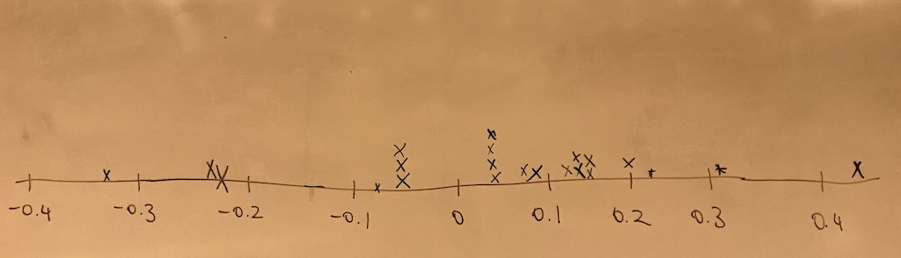

```{r, message = FALSE, warning = FALSE}
library(tidyverse)
```


---

class: middle

# Testing for independence

---

## Is yawning contagious?

.question[
Do you think yawning is contagious?
]

.pull-left[

]
.pull-right[

]

---

## Is yawning contagious?

An experiment conducted by the MythBusters tested if a person can be subconsciously influenced into yawning if another person near them yawns.

https://www.discovery.com/tv-shows/mythbusters/videos/is-yawning-contagious-2

---

## Study description

In this study 50 people were randomly assigned to two groups: 34 to a group where a person near them yawned (treatment) and 16 to a control group where they didn't see someone yawn (control).

The data are in the **openintro** package: `yawn`

```{r}
yawn %>%
  count(group, result)
```

---

## Proportion of yawners

.small[
```{r}
yawn %>%
  count(group, result) %>%
  group_by(group) %>%
  mutate(p_hat = n / sum(n))
```
]

- Proportion of yawners in the treatment group: $\frac{10}{34} = 0.2941$
- Proportion of yawners in the control group: $\frac{4}{16} = 0.25$
- Difference: $0.2941 - 0.25 = 0.0441$
- Our results match the ones calculated on the MythBusters episode.

---

## Independence?

.question[
Based on the proportions we calculated, do you think yawning is really contagious, i.e. are seeing someone yawn and yawning dependent?
]

```{r echo=FALSE}
yawn %>%
  count(group, result) %>%
  group_by(group) %>%
  mutate(p_hat = n / sum(n))
```

---

## Dependence, or another possible explanation?

- The observed differences might suggest that yawning is contagious, i.e. seeing someone yawn and yawning are dependent.

- But the differences are small enough that we might wonder if they might simple be **due to chance**.

- Perhaps if we were to repeat the experiment, we would see slightly different results.

- So we will do just that - well, somewhat - and see what happens.

- Instead of actually conducting the experiment many times, we will **simulate** our results.

---

## Two competing claims

- "There is nothing going on." 
Yawning and seeing someone yawn are **independent**, yawning is not contagious, observed difference in proportions is simply due to chance. $\rightarrow$ Null hypothesis

- "There is something going on."
Yawning and seeing someone yawn are **dependent**, yawning is contagious, observed difference in proportions is not due to chance. $\rightarrow$ Alternative hypothesis

---

## Simulation setup

1. A regular deck of cards is comprised of 52 cards: 4 aces, 4 of numbers 2-10, 4 jacks, 4 queens, and 4 kings.

2. Take out two aces from the deck of cards and set them aside.

3. The remaining 50 playing cards to represent each participant in the study:
    - 14 face cards (including the 2 aces) represent the people who yawn.
    - 36 non-face cards represent the people who don't yawn.

---

## Running the simulation

1. Shuffle the 50 cards at least 7 times<sup>1</sup> to ensure that the cards counted out are from a random process.

2. Count out the top 16 cards and set them aside. These cards represent the people in the control group.

3. Out of the remaining 34 cards (treatment group) count the number of face cards (the number of people who yawned in the treatment group).

4. Calculate the difference in proportions of yawners (treatment - control). This gets you one $\hat{p}$ value. 

5. Do # 1-4 many times

.footnote[
[1] http://www.dartmouth.edu/~chance/course/topics/winning_number.html
]

---

## Simulation by hand

.question[
Do the simulation results suggest that yawning is contagious, i.e. does seeing someone yawn and yawning appear to be dependent?
]



---

## Simulation by computation

```{r}
null_dist <- yawn %>%
  specify(response = result, explanatory = group, 
          success = "yawn") %>%
  hypothesize(null = "independence") %>%
  generate(100, type = "permute") %>%
  calculate(stat = "diff in props", 
            order = c("trmt", "ctrl"))
```

---

## Simulation by computation - 1

.small[
- Start with the data frame
- **Specify the variables**
    - **Since the response variable is categorical, specify the level which should be considered as "success"**

```{r eval=FALSE}
yawn %>%
  specify(response = result, explanatory = group, 
          success = "yawn")
```
]

---

## Simulation by computation - 2

.small[
- Start with the data frame
- Specify the variables
    - Since the response variable is categorical, specify the level which should be considered as "success"
- **State the null hypothesis (yawning and whether or not you see someone yawn are independent)**

```{r eval=FALSE}
yawn %>%
  specify(response = result, explanatory = group, 
          success = "yawn") %>%
  hypothesize(null = "independence")
```
]

---

## Simulation by computation - 3

.small[
- Start with the data frame
- Specify the variables
    - Since the response variable is categorical, specify the level which should be considered as "success"
- State the null hypothesis (yawning and whether or not you see someone yawn are independent)
- **Generate simulated differences via permutation**

```{r eval=FALSE}
yawn %>%
  specify(response = result, explanatory = group, 
          success = "yawn") %>%
  hypothesize(null = "independence") %>%
{{ generate(100, type = "permute") }}
```
]

---

## Simulation by computation - 4

.small[
- Start with the data frame
- Specify the variables
    - Since the response variable is categorical, specify the level which should be considered as "success"
- State the null hypothesis (yawning and whether or not you see someone yawn are independent)
- Generate simulated differences via permutation
- **Calculate the sample statistic of interest (difference in propotions)**
    - **Since the explanatory variable is categorical, specify the order in which the subtraction should occur for the calculation of the sample statistic, $(\hat{p}_{treatment} - \hat{p}_{control})$.**
    
```{r eval=FALSE}
yawn %>%
  specify(response = result, explanatory = group, 
          success = "yawn") %>%
  hypothesize(null = "independence") %>%
  generate(100, type = "permute") %>%
{{ calculate(stat = "diff in props", 
           order = c("trmt", "ctrl")) }}
```
]

---

## Simulation by computation - 0

.small[
- **Save the result**
- Start with the data frame
- Specify the variables
    - Since the response variable is categorical, specify the level which should be considered as "success"
- State the null hypothesis (yawning and whether or not you see someone yawn are independent)
- Generate simulated differences via permutation
- Calculate the sample statistic of interest (difference in propotions)
    - Since the explanatory variable is categorical, specify the order in which the subtraction should occur for the calculation of the sample statistic, $(\hat{p}_{treatment} - \hat{p}_{control})$.
    
```{r eval=FALSE}
{{null_dist <- yawn %>% }}
  specify(response = outcome, explanatory = group, 
          success = "yawn") %>%
  hypothesize(null = "independence") %>%
  generate(100, type = "permute") %>%
  calculate(stat = "diff in props", 
            order = c("treatment", "control"))
```
]

---

## Visualizing the null distribution

.question[
What would you expect the center of the null distribution to be?
]

--

```{r out.height="70%"}
ggplot(data = null_dist, mapping = aes(x = stat)) +
  geom_histogram(binwidth = 0.05) +
  labs(title = "Null distribution")
```

---

## Calculating the p-value, visually

.question[
What is the p-value, i.e. in what % of the 
simulations was the simulated difference in sample proportion at least as extreme 
as the observed difference in sample proportions?
]

```{r echo=FALSE, out.height="80%"}
ggplot(data = null_dist, mapping = aes(x = stat)) +
  geom_histogram(binwidth = 0.05) +
  labs(title = "Null distribution")
```

---

## Calculating the p-value, directly

```{r}
null_dist %>%
  filter(stat >= 0.0441) %>%
  summarise(p_value = n()/nrow(null_dist))
```

---

## Conclusion

.question[
What is the conclusion of the hypothesis test?
]

<br>

--

.question[
Do you "buy" this conclusion?
]